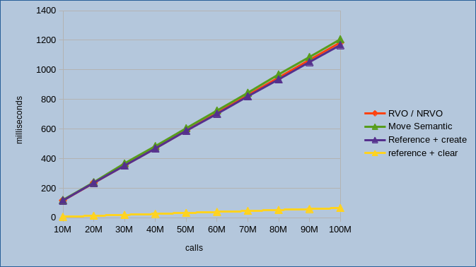
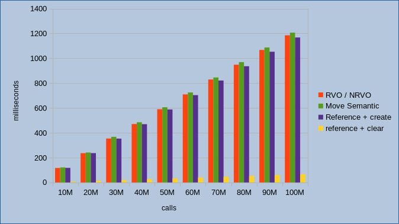

# [The-Magicians](../README.md): copy-elision

Last update: 07 July 2022

To better understand what is the [*copy-elision*](https://en.cppreference.com/w/cpp/language/copy_elision) and all the benefits of such functionality we should go back in time, and more specifically before the introduction of [C++11](https://en.wikipedia.org/wiki/C++11) in which such optimization has been introduced for the first time together with the move semantic. The C++11 introduced significant changes in the standard but here we will focus on the move semantic and to the copy-elision functionality that where we will put all our attentions. In more recent standards, the *copy-elision* have been revisited in order to extend ranges of context where it can be applied from the compiler or when to use the move semantic instead. So for our discussion we have two specific moment in time, *before C++11* and *after C++11*.

Following, in our examples we will use an `std::vector<int>` that on a 64 bits system count a size of 24 bytes, it could be possible to use more complex and bigger data type, for example a custom structure or class to repeat all test with something bigger than 24 bytes, but what will be necessary is to have implemented at least `Default Constructor`, `Copy Constructor`, `Move Constructor`, `assignment operator` and `move assignment operator`, all of these are already present/implemented for all STL containers accordingly with used C++ standard.

## Before C++11

Let's start with c++98 and more specifically wiht something considered inefficient and clearly to be  avoid in order to preserve performances.

### Function 1 

The following function don't do too much, but it is enough for our scope. The function just create and return a `vector` of `integers` that contains `a` and `b`.


```cpp
std::vector<int> create_vector( int a, int b )
{
  std::vector<int> retValue;

  retValue.push_back(a);
  retValue.push_back(b);

  return retValue;
}
```

Now, we want to clarify why the above code for the [Function 1](#function-1) was badly performing and for that purpose we will define two use cases

### Function 1 - c++-98 - Use Case 1
```cpp

#include <iostream>
#include <vector>

int main()
{
  std::vector<int>  vec = create_vector( 10, 20 );

  std::cout << vec.size() << std::endl;

  return 0;
}

```

Provide source code is valid, so it possible to building it using an old compiler such as `x86-64 gcc 4.1.2` with the following flags `-std=c++98 -O3`. The program will be generated and will do the job.

But, let's dig a bit to see what happens when the code is executed.

1) the `main()` function will create on the stack an `std::vector<int>` named `vec` to receive output from `create_vector()` -- (24 bytes)
2) calling the function `create_vector()` we have:

    2.1) calling the function should create on the stack the return value and parameters for the function, so we have basically (24 bytes + 4 bytes + 4 bytes)
    
    2.2) once we are in the scope of `create_vector()`, so inside the function, then we have one more object that will be allocated on the stack (24 bytes) and then returned 

    2.3) when we exit from the scope of `create_vector()` so when execution reaches the return statement, then the value of `retValue` will be copied into the memory allocated for the return value at 2.1)

3) we are back to the `main()` function, and here finally we can initialize `vec` with the result of `create_vector()` and here the `copy constructur` will be invoked.

So in summary, we have `3 x allocations` for `std::vector<int>` and `2 x copy` that will be performed during the execution. That's a lot of extra work for returning a simple vector. So clearly there is room for few optimizations, but remember that right now we are working with c++98, so let's see what we can do, but just before that we inspect the second use case for [Function 1](#function-1). 

### Function 1 - c++-98 - Use Case 2

```cpp

#include <iostream>
#include <vector>

int main()
{
  std::vector<int>  vec;
  
  vec = create_vector( 10, 20 );

  std::cout << vec.size() << std::endl;

  return 0;
}

```

The difference between [Use Case 1](#function-1---c-98---use-case-1) and [Use Case2](#function-1---c-98---use-case-2) basically rely on allocating the vector with the default constructor and then using assign operator `=` to copy the result of `create_vector()` into `vec`, in terms of operation we just pay the bill for calling the `Default Constructor` for `std::vector<int>`, so not more than before but surely there are some extra operations.

Once we see what is supposed to be avoided, let's see a possible improvement to all that instances and copy operations.

### Function 2 

Following a little revision for the previous [Function 1](#function-1) in which we removed the return value by replacing it with `void` and then we introduced a new parameter that is a reference to an `std::vector<int> `.

```cpp
void create_vector( std::vector<int>& output, int a, int b )
{
  output.clear();

  output.push_back(a);
  output.push_back(b);
}
```

With this new function we expect that output vector will be provided when the function will be invoked, so we do not need to allocate internally a temporary variable and we don't need to return such object when we exit from the function. 

An using example for [Function 2](#function-2) is the following:

### Function 2 - c++-98 

```cpp

#include <iostream>
#include <vector>

int main()
{
  std::vector<int>  vec;
  
  create_vector( vec, 10, 20 );

  std::cout << vec.size() << std::endl;

  return 0;
}

```

In terms of operation we moved from `3 x instances` + `2 x copy` to
- `1 x instance`: we are creating one sigle object in the main function
- `0 x copy` : we removed all copy
- `1 x clear` : we have one extra call, we dind't see before that is clear() and is itended to guarantee that the vector is empty before to start pushing the two values.

Our intuition for sure will tell us that [Function 2](#function-2) have better performance than [Function 1](#function-1), and if so, please listen to your intuition since it is right and we will measure all of that.

## After C++11

After this short introduction :D, we finally arrived in the year 2011, and we all seen some radical changes in the C++ world, something good, something to be improved but surely moving forward and not static.

Before to proceed, I just have one question ... can you image how much code like [Function 1](#function-1) with related use cases have been written, and let me limit, from 1998 up to 2011 ? ... 

Ok, we don't care, since that what we defined `inefficient code` before C++11, now after the introduction of the new standard become the `canonical code` and this thanks to some changes that have been introduced with in all compilers that support the C++11. This also means that all code written before C++11 can now be recompiled with a new compiler and will automatically leverage from all new optimizations.

Those introductions and relevant for our discussion are:
- RVO & NRVO: Return Value Optimization and Named RVO. This kind of optimization are performed from the compiler under some circumstances and allow to avoid to copy objects between called and caller 
- Move semantic: that in our context, is the second option used from the compiler when RVO and NRVO cannot be applied.

In short the two bullet above are that's the [*copy-elision*](https://en.cppreference.com/w/cpp/language/copy_elision) so we finally arrived to the title of this article, but not to the end.

RVO and NRVO are basically intended to catch the same condition, that is when a local variable is returned to the caller the only difference consists in that NRVO is a variable declared in the scope of the function, instead in case of RVO this is a temporary object returned directly, so in our [Function 1](#function-1) we have a potential NRVO, instead if we were returning directly and instance such as `return std::vector<int>();` then in such case we have a potential RVO.

So what is going on with the [Use Case 1](#function-1---c-98---use-case-1) and [Use Case 2](#function-1---c-98---use-case-2) we analysed at the beginning of this article?

First of all the compiler will detect all function like our [Function 1](#function-1) in which a local variable is returned to the caller, and will mark all of them as RVO or NRVO.
Second, in all occurrence, so whether such [Function 1](#function-1) is invoked the compiler will try to optimize the code and to avoid extra allocation, so coming back to [Use Case 1](#function-1---c-98---use-case-1) we will have only one call object that will be created and this object will match with the memory allocated in the `main()` function. This is a consistent improvement if compared to where we start with `3 x instances` + `2 x copy`.
For the [Use Case 2](#function-1---c-98---use-case-2) we are not creating the object, instead we are using the assignment operator with an object that is already created, so in this case the compiler in order to avoid the copy of all elements in the local variable, and due to the fact that immediately after such object will be destroyed, will call automatically move all pointers and data from local object to the destination object, and then invalidate the local object. This means that in our specific case, where we have a vector, all its content will be moved to the destination object, so counters will be assigned, but allocated memory will just change ownership.

Well well, we saw something moving from "don't do that" moving to be the "convention" today presumably adopted by all, now that we have all theory, and hopeful it is enough clear for all readers, then it is time for some experiments.


## Graph Time

What we will do in this section will be to compare performances between different approaches we saw in the above, as for reference:
- **RVO/NRVO** : *we create the conditions for RVO/NRVO optimization*
- **Move Semantic** : *we create the conditions for the Move Semantic optimization*
- **Reference + Create** : *create an object and then call the function passing object by reference*
- **Reference + Clear** : *crate a global object and then then call the function passing object by reference, called function in this case perform a call to clear() to ensure initial status to empty.*

All test will be perfomed using one of the latest compiler available and using the latest standard implemented today.

In order to avoid different results due to different implementations on compilers, I executed some preliminary tests on three compilers (`gcc`, `clang`, `msvc`), but due to the fact that results are not affected by the compiler in fact the trend is the same for all of them, I just presented results obtained with `gcc` also for the fact that comparing the compilers and generated code is out of the scope of this article.

*Only one note related to MSVC that I noticied and I will report here.*
- *compiler `x64 MSVC v19.32`*
- *compiler options `/std:c++20` and `/O2`*

*If `/Ox` `/O1` or `/O2` is not specified, the compiler apply the `move-semantic` even when there are the conditions for RVO/NRVO and this have a minimum impact on performances. So, if you are using MSVC for your program, take care to enable optimizations. The behaviours for GCC and CLANG instead is the same in all conditions, so they both apply RVO/NRVO and `move-semantic` in the "correct" conditions.*

The results presented in the two coming tests have been obtained with the following compiler: 
- compiler `g++ 12.0.1`
- options `-std=c++20` `-O3`

Anyway, results can be replicated with other compilers.

### Test 1 - *Constant calls with variable items*

In this first test we are going to measure the time required to execute 1 Million calls on the following two functions and increasing number of `items`.

First iteration we have 1 Million calls with `items = 1000`, then 1 Million calls with `items = 2000` and so on up to `10000 items`.


```cpp
std::vector<int> get_vector_ce( int items ) noexcept  // _ce stand for Copy-Elision
{
  std::vector<int> out;

  for ( auto i = 0; i < items; ++i )
  {
    out.push_back(i);
  }

  return out;
}

constexpr void get_vector_ref( int items, std::vector<int>& out ) noexcept // _ref stand for Reference
{
  out.clear();

  for ( auto i = 0; i < items; ++i )
  {
    out.push_back(i);
  }
}
```

Here the results with two different views.


From the graphics we can see that "Reference + Clear" increase linearly with the number of items, that is quite normal since we have more calls to `push_items()` for the vector, so internal loop inside the function.

We should expect the same trend for `RVO/NRVO` and for the Move-Semantic, instead the graph show a non-linear trend. Moreover, from the same graph we can see that in general Move-Semantic and `RVO/NRVO` are very closer in terms of execution time, but as expected the `RVO/NRVO` has a bit better performance than the `Move-Semantic`.

`Reference + Clear` result **45.45%** faster than `RVO/NRVO` and **45.85%** faster than `Move Semantic`.


### Test 2 - *Constant items with variable calls* 

In this second test we are going to use a fixed number of `items`, and more specifically we are pushing only one single item in the vector, but this time we will increate number of calls to the function. 

First iteration perform `10 Million calls`, second iteration `20 Million calls` and so on up to `100 Million calls`.

In this test we add also `Reference + Create` and for that we discussed in the first part of this article, we are expeting a perfect match with `RVO/NRVO` timing.

Here the results with two different views.

|||
|--|--|

The first 3 lines are so closer and at least for RVO/NRVO and Move Semantic we have a confirmation on what we have seen also in [Test 1](#test-1---constant-calls-with-variable-items); The purple line related to `Reference + Create` show that we have some improvements increasing the number of calls:
- up to **1.47%** better than `RVO/NRVO`
- up to **3.24%** better than `Move-Semantic`.

It is really interesting the result for `Reference + clear` where we register up to **94%** better performances compared to all other implementations. Moreover, don't forget we just used a simple `std::vector` with a relative small size of `24 bytes`, so repeating our tests with larger objects will only increase the gap with other implementations.

What is emerging from collected results is clear and don't let us any doubt on the fact that creating the object all the time we invoke a function is responsible for this huge gap between the first three implementation and the last one.

**Note**: *graph and related data available here [Performances.xlsx](.resources/performances.xlsx).*

**Note**: here the source code [main_test1.cpp](.resources/main_test1.cpp) for [Test 1](#test-1---constant-calls-with-variable-items).

**Note**: here the source code [main_test2.cpp](.resources/main_test2.cpp) for [Test 2](#test-2---constant-items-with-variable-calls).

## Conclusion

We have seen theory, we have seen some performances, now is time to do our evaluations.

Something that I would like to avoid is that this reading will transfer the wrong message, so I would like to be clear or better crystalline:

<<"All the optimizations behind the `copy-elision` are valuable and in the right context should be used.">>

***Which is the right context, then?***

It depends on the application, so it strongly depends on what we want to do and from expected results. This means that if our application are required to be as much faster as possible, then it is important to take in account results presented in this article and then try to optimize all functions that have a high calling rate and taking in account that what we have seen in this article just cover one simple functionality / optimization, but surely is not the only way to write high performing source code.

Surely we cannot hope that the compiler will do the job on behalf of software engineers, the compiler cannot do any analysis to create the best algorithm or at least an algorithm with an optimum solution (not yet), as well as the compiler do not know which is the context of our application, if there are specific requirements to be satisfied that include execution time as well as memory usage. 

The best practice should be to find out a rationale for all that we do and to understand that the first optimizer is the software engineer, not the compiler. The compiler will help for sure and will be able to perform hundreds of little optimizations as well as to detect "anomalies" raising warnings to be addressed and not be ignored.

## Thanks for reading

If you have 30 minutes of spare time, please do not miss to see this [video](https://youtu.be/hA1WNtNyNbo) with a talk on RVO presented by **Arthur O'DWYER** at [CppCon.org](https://cppcon.org/) 2018. 

Hope you enjoyed this article, personally I had some fun writing it :D
