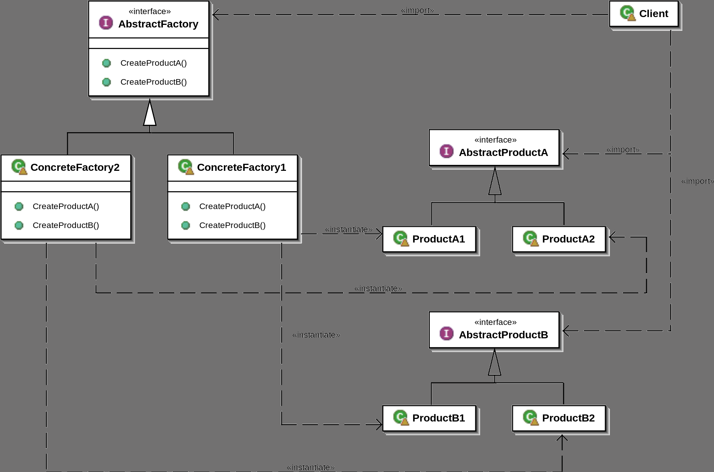

# [The-Magicians](../../README.md): Abstract Factory with templates 

Last update: 22 September 2022

Almost everyone knows this `creational pattern` that is exceptionally useful in many applications, sometimes alone sometimes in conjunctions with other patterns. This design pattern is well described from [GoF (Gang of Four)](https://en.wikipedia.org/wiki/Design_Patterns) in their book "Design Patterns" published in the far '94 and in OOP it is still actual after 28 years.

In the following figure the well known UML diagram that describe this pattern. 

*Orginal image on wikipedia at [https://en.wikipedia.org/wiki/Abstract_factory_pattern](https://en.wikipedia.org/wiki/Abstract_factory_pattern).* 

Last month I was working on G.A.I.A. a fun and I hope useful project/service that will be available to the public in a couple of months, and I had two different contexts where usage of the abstract factory pattern was perfect. Initially I was going to implement it with the classic approach, the mentioned UML in figure above, but before to start I told to myself <<"why don't do it only once leveraging templates and tmp!">>. At this point, I start to search over internet if someone has my same thought and then avoid myself to spend time implementing something that was already done. Good news, many peoples had my same thought, bad news, all implementations was *dynamic* and mostly based on `std::unordered_map` or `std::map`, so far away from what I was looking for ..., but in the middle of all I found an interesting design, not really usable for my scope, but fascinating since it was very closer to what I had in mind, so instead of starting from scratch I start a review for such design and I come to a generic solution that I guess will be able to address different contexts, I happily used it in two different working condition and I'm more than satisfied from results even there are some other improvements that can be done.

***NOTE**: If someone is interested in the original code and related review, here is the direct link to [Code Review](https://codereview.stackexchange.com/questions/240157/c-template-to-implement-the-factory-pattern/279300#279300) page.*

***NOTE**: if someone is only interested to the solution, please refer to this [repository](https://github.com/fe-dagostino/lock-free) where you can find the [solution](https://github.com/fe-dagostino/lock-free/blob/master/include/core/abstract_factory.h) and also some [examples](https://github.com/fe-dagostino/lock-free/blob/master/examples/abstract_factory.cpp) on how to use it.*

For the remaining readers that are interested to know this solution more in details, please continue reading.

## Context

We are going to create and templated `abstract_factory` that automatically implements all concrete factory classes and produce most of the code at build time instead of run-time, where this last is only for final instance itself.

**Note**: for the rest of the article I'm using `g++` `v12.1` with `-std=c++20` on `x86_64 architecture`, anyway functionalities are supported also from CLang and MSVC, only take care to use `c++20` since it is required in our steps.

## Implementation 

So, let's dig in details with the code, explaining all step-by-step.

### Static identifier  

In order to identify the type we want to instantiate we need to provide an unique identifier to our abstract_factory that allow to select correct type. The reason why this should be static is due to the fact we want to solve the relationship [uid,type] a at build-time. Moreover in order to be used this static data shall be available on all types we want to instantiate. I believe that a string is generic enough to handle all needs, but it could be easily replaced with any other type. 

So, let's says we want to provide a `name` to all our types, and such name will be provided as a template parameter. Supposing we have a base `class animal` we would like something like the following code:

```cpp
#include <iostream>

class animal 
{
  public:
    animal(){};
    virtual ~animal(){};
    virtual void draw() = 0;
};

class shrug : public animal, public plug_name<"shrug">
{
public:
  virtual void draw() override { std::cout << "¯\\_(ツ)_/¯" << std::endl; };
};

class koala : public animal, public plug_name<"koala">
{ 
public:
  virtual void draw() override { std::cout << "ʕ•ᴥ•ʔ" << std::endl; };
};

class bear : public animal, public plug_name<"bear">
{ 
public:
  virtual void draw() override { std::cout << "⊂(￣(ｴ)￣)⊃" << std::endl; };
};

class kitty : public animal, public plug_name<"kitty">
{ 
public:
  virtual void draw() override { std::cout << "˄·͈༝·͈˄" << std::endl; };
};
```

The first problem with the above code is that template do not accept literals, but thanks to a feature (*non-type template auto deduction [P0424](https://www.open-std.org/jtc1/sc22/wg21/docs/papers/2017/p0424r2.pdf)* ) available since `c++20`, we could achieve what we want with the following type definition.

```cpp
#include <algorithm>  // required for std::copy_n

template<std::size_t size>
struct tstring_t {
    /***/
    constexpr tstring_t(const char (&str)[size]) 
    { std::copy_n(str, size, _in_string); }

    /**
     * Return string length.
     */
    constexpr std::size_t length()  const 
    { return size-1; }
    /**
     * Return a pointer to the null terminated string.
     */
    constexpr const char* c_str() const
    { return &_in_string[0]; }

    char _in_string[size];
};
```
usage for the above type `tstring_t` will be something like:
```cpp
...
....
  tstring_t _text("text");
  std::cout << _text.length() << std::endl;
  std::cout << _text.c_str() << std::endl;
...
....  
```
As we can see in the above example, we never specified the value for not-type template `size`, but this is deducted from the constructor where we provided an array of `char` that is 5 chars (4 chars used for "text" + 1 char for string termination '\0'), we are providing this information at build-time and this means that the compiler can replace `size` with the correct value specifically for the string we provided.

At this stage, we have a new type that we can use as template parameter to create our static "plug_" the *type name*.

```cpp
template<tstring_t str>
struct plug_name
{ 
  constexpr static const bool             has_name = (str.length()>1)?true:false;
  constexpr static const std::string_view name     = str.c_str();
};
```

We are also going to define a concept to make sure that each single class we will provide contains the two static members both `has_name` and `name`.

```cpp
/**
 * @brief Define concept for plug_name interface requirements.
 */
template <typename P>
concept plug_name_interface = requires( ) 
{
  { P::has_name };
  { P::name     };
};
```

In case we will not respect the interface, an error will be raised at compile-time forcing us to manually add such static members or more simply to inherit our class from `plug_name`.

Well, first step is completed and our code now can compile.

**Note**: `tstring_t`, `plug_name` and `concept plug_name_interface` are defined in [lock-free/include/core/type.h](https://github.com/fe-dagostino/lock-free/blob/master/include/core/types.h) under the namespace `core`.

### `type_traits` and `algorithm` extensions

Before moving to the final implementation for the `abstract_factory` we need to create some utility, to help us on validating template parameters.

#### `core::are_base_of` as extension for `std::is_base_of`

Since `c++11` in <type_traits> there is [std::is_base_of](https://en.cppreference.com/w/cpp/types/is_base_of) as part of [metaprogramming library](https://en.cppreference.com/w/cpp/meta), while in `c++17` have been introduced [std::conjunction](https://en.cppreference.com/w/cpp/types/conjunction), we leverage both to create our variadic version `are_base_of`. 

```cpp
/**
 * @brief std::is_base_of extended for multiple types
 */
template<typename base_t, typename... others_t>
struct are_base_of
{ constexpr static const bool value = std::conjunction_v<std::is_base_of<base_t,others_t>... >; };
```
and then the *concept* we need in our implementation for the `abstract_factory`.

```cpp
/**
 * @brief Define concept checking that all @tparam others_t types are derived from @base_t.
 */
template<typename base_t, typename... others_t>
concept derived_types = requires
{
  requires are_base_of<base_t,others_t...>::value;
};
```

This simple concept will be used to ensure that all types we are going to provide to the `abstract_factory` are all derived classes or more in general derived types of `base_t`.

**Note**: both `are_base_of` and `concept derived_types` are defined in [lock-free/include/core/type.h](https://github.com/fe-dagostino/lock-free/blob/master/include/core/types.h) under the namespace `core`.

#### `all_of` and `count_if` for tuple

`std::all_of` have been introduced since `c++11` instead `std::count_if` have been introduced starting from `c++17` and extended in `c++20`, however both are not foreseen to handle  `std::tuple`, not at the moment at least, so we will create our version for both.

```cpp
/** 
 * @brief Check if specified function is 'true' for each tuple element 
 *
 * \tparam tuple    tuple on which to iterate
 * \tparam func     function( auto& tuple_item ) -> bool 
 */
template <size_t I = 0, typename Func, typename... Ts>
constexpr bool all_of(std::tuple<Ts...> tuple, Func func ) noexcept
{
  if constexpr ( I != sizeof...(Ts) )
  { return func( std::get<I>(tuple) ) && all_of<I + 1>(tuple,func); }

  return true;
}
```

```cpp
/**
 * @brief Execute if specified function for each tuple element and count all `true`
 * 
 * \tparam tuple    tuple on which to iterate
 * \tparam func     function( auto& tuple_item ) -> bool 

 * @return constexpr std::size_t number of occurrences for `true`
 */
template <size_t I = 0, typename Func, typename... Ts>
constexpr std::size_t count_if(std::tuple<Ts...> tuple, Func func ) noexcept
{
  if constexpr ( I != sizeof...(Ts) )
    return (func( std::get<I>(tuple) ) == true) + count_if<I + 1>(tuple,func);

  return 0;
}
```

Both the above implementation can compile starting from `c++17` due to `if constexpr`. In case someone want to use both with `c++11` or `c++14` then we need two functions, one to iterate increasing `I` and the other one for the exit condition. In our example we are in `c++20`, so we are good with the two implementation above.

**Note**: both `all_of` and `count_if` are defined in [lock-free/include/core/type.h](https://github.com/fe-dagostino/lock-free/blob/master/include/core/types.h) under the namespace `core`.

Fine, now let's move to final implementation ... 

### abstract_factory implementation

Here we are, we have all building block that we need to create the final solution and then explain the different choices.

```cpp
template<typename base_t, typename default_t, typename... others_t>
  requires derived_types<base_t,others_t...> && 
           ( std::is_base_of_v<base_t,default_t> || std::is_same_v<default_t,std::nullptr_t> )
class abstract_factory 
{
public:
  /***/
  template<typename derived_t>
    requires plug_name_interface<derived_t>
  struct concrete_factory {
    std::string_view name = derived_t::name;

    /** Create derived class instance forwarding arguments. */
    template<typename... args_t>
    std::unique_ptr<base_t> create( args_t&&... args )
    {  return std::make_unique<derived_t>( std::forward<args_t&&>(args)... ); }
  };

  /* alias */
  using concrete_factories = std::tuple<concrete_factory<others_t>...>;

  /***/
  constexpr inline abstract_factory() noexcept
  {
    /* Check that all names appears only one time*/
    constexpr bool all_names_once = all_of( concrete_factories{}, 
                                            []( const auto& tuple_item ) -> bool { 
                                              return( count_if( concrete_factories{}, 
                                                                [&id=tuple_item.name]( const auto& item ) -> std::size_t { 
                                                                    return (item.name == id); 
                                                                } ) == 1); 
                                            }   );
    static_assert(all_names_once, "name must be unique");
  }

  template<typename... args_t>
  constexpr inline std::unique_ptr<base_t> create(const std::string_view& id, args_t&&... args ) 
  {
    std::unique_ptr<base_t> result = nullptr;

    // if concrete_factory matches with the name, use the concrete factory to create the new instance.
    std::apply( [&result, &id, &args...](auto&&... tuple_item ) {
                    (( tuple_item.name == id ? result = tuple_item.create( std::forward<args_t>(args)... ) : result ), ...);
                }, concrete_factories{}
              );

    if ( result == nullptr )
    {
      if constexpr ( std::is_same_v<std::nullptr_t,default_t> == false )
      { result = std::make_unique<default_t>( std::forward<args_t>(args)... ); }
    }

    return result;
  }
};
```

The principal class take three differnt arguments:

```cpp
template<typename base_t, typename default_t, typename... others_t>
  requires derived_types<base_t,others_t...> && 
           ( std::is_base_of_v<base_t,default_t> || std::is_same_v<default_t,std::nullptr_t> )
class abstract_factory 
```
* *base_t* : this is the base type from which all `others_t` must inherit and the `requires` allow us to guarantee that such inheritance is respected.
* *default_t* : it is used to specify default type that could be `std::nullptr_t` or an instance we would like to use as default return value. Also `default_t`, if not equal to `std::nullptr_t`, must be a type derived from `base_t`.
* *others_t* : a variadic where we can list all our derived types. 

Reading forward we found an inner class declaration related to `concrete_factory`, the `requires` immediately after the template add the constraints that `derived_t` must have the two static members `name` and `has_name`. Then we have one single method create() that can take an arbitrary number of parameters that will be forwarded to the constructor.

```cpp
  template<typename derived_t>
    requires plug_name_interface<derived_t>
  struct concrete_factory {
    std::string_view name = derived_t::name;

    /** Create derived class instance forwarding arguments. */
    template<typename... args_t>
    std::unique_ptr<base_t> create( args_t&&... args )
    {  return std::make_unique<derived_t>( std::forward<args_t&&>(args)... ); }
  };

  using concrete_factories = std::tuple<concrete_factory<others_t>...>;
```

Here the interesting part, when we build `std::tuple` with as many concrete_factory as `others_t` expanding paramenter pack `concrete_factory<others_t>...`. The tuple `concrete_factories` is used to search the `concrete_factory` corresponding to the type identifier we would like to create.  

```cpp
  template<typename... args_t>
  constexpr inline std::unique_ptr<base_t> create(const std::string_view& id, args_t&&... args ) 
  {
    std::unique_ptr<base_t> result = nullptr;

    // if concrete_factory matches with the name, use the concrete factory to create the new instance.
    std::apply( [&result, &id, &args...](auto&&... tuple_item ) {
                    (( tuple_item.name == id ? result = tuple_item.create( std::forward<args_t>(args)... ) : result ), ...);
                }, concrete_factories{}
              );

    if ( result == nullptr )
    {
      if constexpr ( std::is_same_v<std::nullptr_t,default_t> == false )
      { result = std::make_unique<default_t>( std::forward<args_t>(args)... ); }
    }

    return result;
  }
```

Accordingly with original implementation this method was static, but in such case we have two possible issue coming from its usage: 
* different `derived_t` with same name: when a `name` is present more than once in our list of `others_t`
* double declaration `derived_t`: when same type is repeated two or more times in the same list of `others_t`

Both can be condition can be handled if we guarantee that `name` is unique in an `abstract_factory` instance, and here we will use our helper functions to perform such check at compile-time and only once. The method `create()` in our implementation is declared as `constexpr` and not as `static`, so it rely on an `instance` to be invoked, this also mean that we need to create an object for the class `abstract_factory` and in its constructor we will hide our check at compile time.

```cpp
  /***/
  constexpr inline abstract_factory() noexcept
  {
    /* Check that all names appears only one time*/
    constexpr bool all_names_once = all_of( concrete_factories{}, 
                                            []( const auto& tuple_item ) -> bool { 
                                              return( count_if( concrete_factories{}, 
                                                                [&id=tuple_item.name]( const auto& item ) -> std::size_t { 
                                                                    return (item.name == id); 
                                                                } ) == 1); 
                                            }   );
    static_assert(all_names_once, "name must be unique");
  }
```
The `constexpr` declaration for `bool all_names_once` here is fundamental, since we want to resolve the two nested call to `all_of` and `count_if` at compile time in order to have the `static_assert`.
The first call to `all_of` will iterate on all `concrete_factories{}` invoking a `lambda` that will return `true` only if nested `count_if()` return with a total count of `1`.
This simple call can guarantee that a specific `name` is present only one time, so we avoid a possible human error and code will run correctly.

#### Possible improvements
In the presented implementation for the `abstract_factory` there are two possible improvements:

* **default_t**: could be a complete different type and in order to achieve that interface could be updated to return `std::optional`, but with side effect to add complexity in both the implementation and for its usage.
* **create**: can be next optimization, and more in details when `concrete_factories{}` is a consistent number of items ( > 1000 ) we can have an impact if compared to an `std::unordered_map`, at the moment I didn't specific benchmarks, I'll do surely trying to optimize this part. 

### abstract_factory usage

Now that we have our implementation done, is time to see it in action, then coming back to our initial set of classes `animal`, `shrug`, `koala`, `bear` and `kitty` lets see a possible usage.

```cpp
  // Alias just to reduce typing
  using factory_t = core::abstract_factory< animal,  shrug,    koala, bear, kitty >;
  //                                          ^        ^       ^                ^ 
  //                                        base_t  default_t      others_t ...

  // then our factory, finally                                        
  factory_t factory;

  std::unique_ptr<animal> _ptrDefault  = factory.create("undefined");  // "undefined" do not exist so 
                                                                       // we expect that a default will 
                                                                       // be instantiated in this case. 
  std::unique_ptr<animal> _ptrDerived0 = factory.create("koala");
  std::unique_ptr<animal> _ptrDerived1 = factory.create("bear");
  std::unique_ptr<animal> _ptrDerived2 = factory.create("kitty");

  assert( _ptrDefault  != nullptr  );
  assert( _ptrDerived0 != nullptr  );
  assert( _ptrDerived1 != nullptr  );
  assert( _ptrDerived2 != nullptr  );

  _ptrDefault->draw();  // draw the shrug  
  _ptrDerived0->draw(); // draw a koala
  _ptrDerived1->draw(); // draw a big bear
  _ptrDerived2->draw(); // draw a kitty cat
```

The above is just a simple example, but the important part is that we just need 2 lines of code to create all that we need, since `abstract_factory` is generic.

**Note**: both `abstract_factory` and a more complete example can be found in the lock-free repository [lock-free/include/core/abstract_factory.h](https://github.com/fe-dagostino/lock-free).

*Moreover, following this link on [godbolt](https://godbolt.org/z/Kzxxq59P6) there is a live example to experiment with.*

## Conclusion

As usual, what we did in the above with `abstract_factory`, should help us to:
* write less code
* keep all implementation in one place, so avoid mistakes and bugs propagation
* avoid humans error and avoiding to have bugs in production
* use compiler to do the job once, when possible
* register a general improvement in performances

For the last bullet in the above I would like to share some concrete result. Recently I reingenirised a tool in order to overcome some limitation in my first implementation. Except the architecture, first and second tool can produce the same output starting from the same input, but with different times and this due to the fact that in the first there is a large use of std::map, std::unordered_map and std::vector instead the second one leverage both [lock-free](https://github.com/fe-dagostino/lock-free) and [libcsv](https://github.com/fe-dagostino/libcsv) with less usage of dynamic data structure and with a reduction of memory allocation.
For the first tool the total investment in terms of time was `~32h` instead for the second there is an investment of about `160h` total. From a comparison between the two tools, while the first one take about `443s` to process a GTFS of `~50MB` the second one, that use the same configuration [gtfs.cfg](.resources/gtfs.cfg) and take the same input set of `~50MB`, is producing exaclty the same result but in `1.806300s` that is a huge amount of time, surely more than my personal expectations expecially if we consider that first one was alredy fast if compared to other tools. 

This is a great example in which a little more investment in terms of `human time` and a bit more complexity at `compile time` can generate an huge saving a `run-time` and consequently with **less energy**, so efficiency doesn't mean going faster just to be faster but also saving important resources (*let's be kind to our little planet!*).

## Thanks for reading

I hope the content of this article was not boring and that you enjoyed reading it, and much better if you learn something and the content can help you in your daily job within your projects.